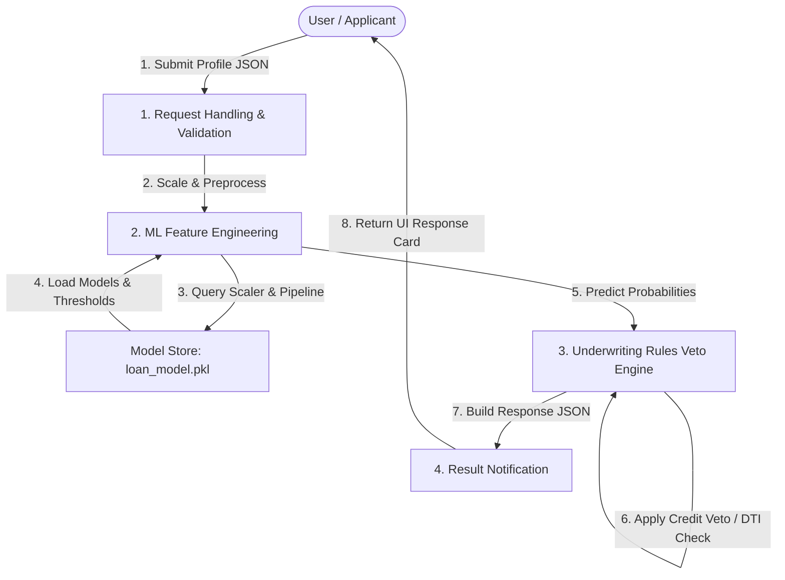

# Data Flow Diagram

| Field | Details |
| :--- | :--- |
| **Date** | 15 March 2026 |
| **Team ID** | PNT2022TMID124356 |
| **Project Name** | SmartLender AI – Loan Eligibility Prediction |
| **Maximum Marks** | 2 Marks |

---

## DFD Symbol Legend

Use the standard data flow diagram (DFD) components to illustrate how applicant data traverses the system boundaries.

| Symbol | Name | Description |
| :--- | :--- | :--- |
| **Oval / Rounded shape** | External Entity | A person, organization, or system outside the project that sends or receives data (e.g., Customer, Underwriter). |
| **Rectangle with numbered header** | Process | An activity that transforms incoming data into outgoing data (e.g., Validate Request, Calculate Eligibility). |
| **Rectangle (solid fill, no number)** | Data Store | A place where data is held for later use (e.g., Model Storage, Logs). |
| **Labeled arrow** | Data Flow | The movement of data between entities, processes, and data stores. |

---

## Data Flow Diagram (DFD Level 1)

### Component Details
1. **User / Applicant:** Submits parameters (Gender, Married, Dependents, Education, Self_Employed, ApplicantIncome, CoapplicantIncome, LoanAmount, Loan_Amount_Term, Credit_History, Property_Area) via the web frontend.
2. **Request Handling & Validation:** Flask handler validates input values, checking for correct ranges.
3. **ML Feature Engineering:** Scales input numerical features using the pre-loaded Pickle preprocessor.
4. **Underwriting Rules Veto Engine:** Intercepts predictions to enforce credit score constraints (Veto if Credit_History = 0).
5. **Result Notification:** Formats response into clean decision results for the UI card.
