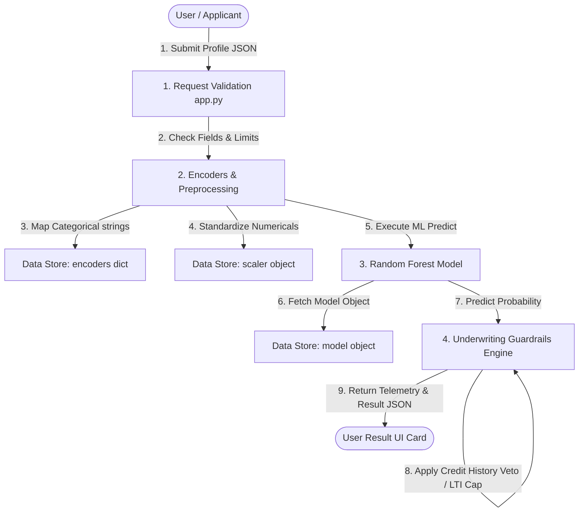

# Data Flow Diagram

| Field | Details |
| :--- | :--- |
| **Date** | 15 March 2026 |
| **Team ID** | PNT2022TMID124356 |
| **Project Name** | SmartLender AI – Loan Eligibility Prediction |
| **Maximum Marks** | 2 Marks |

---

## DFD Symbol Legend

Use the standard data flow diagram (DFD) components to illustrate how applicant data traverses the system boundaries.

| Symbol | Name | Description |
| :--- | :--- | :--- |
| **Oval / Rounded shape** | External Entity | A person, organization, or system outside the project boundaries (e.g., Customer, Underwriter). |
| **Rectangle with numbered header** | Process | An activity that transforms incoming data into outgoing data (e.g., Encode Categoricals, Scale Numerical Features). |
| **Rectangle (solid fill, no number)** | Data Store | A place where data is cached for retrieval (e.g., model_artifact dict, encoders list). |
| **Labeled arrow** | Data Flow | The movement of data between processes and stores. |

---

## Data Flow Diagram (DFD Level 1)

### Component Details
1. **Request Validation (`app.py`):** Ensures numeric fields are positive and checks for missing categorical features.
2. **Encoders & Preprocessing:** Maps values (`Graduate` to 1, `Rural` to 0, etc.) and scales incomes using `scaler.transform()`.
3. **Underwriting Guardrails Engine:** Performs credit score veto logic (`Credit_History == 0.0`) and calculates Debt-to-Income (DTI) metrics.
